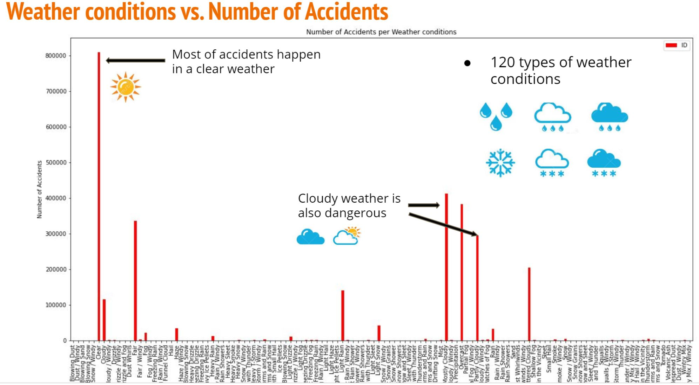
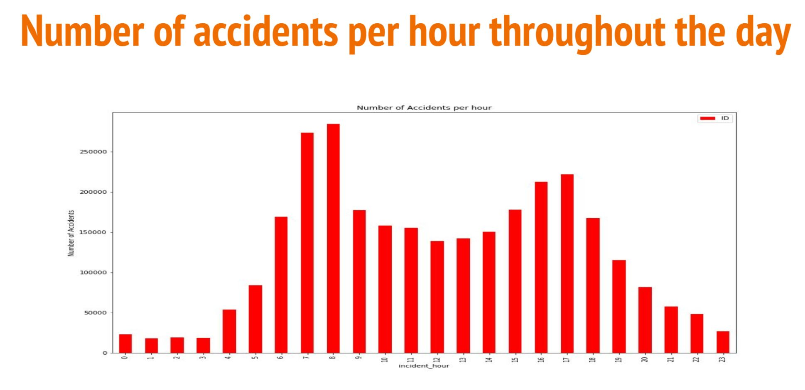
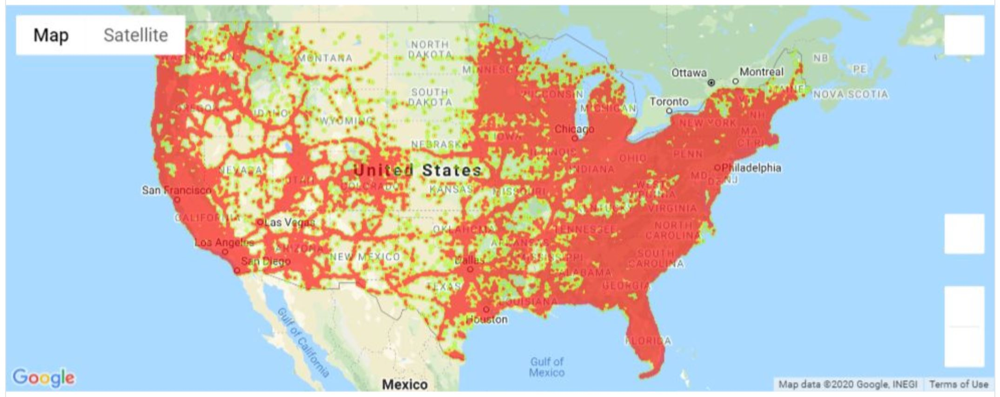

# US Car Accidents Project

In this project 4 of us worked together to analyze data on US Car accidents.

The dataset was large, including more than 3M rows.

The dataset was from Kaggle, and the technologies used were Pandas, Python, NumPy, and Matplotlib.

We used these tools to create a number of visualizations that illustrated different aspects of what was affecting car accidents. We looked at weather, location, and time of day as the main factors in our analysis. When looking at the data the key trend was that when more cars were on the road there were more accidents. So, one may think that for example during bad weather there are the most accidents, but since there are more cars on the road during clear weather days more accidents happen then. 

Also, we found that during morning and evening commutes there were more accidents and in the states with the highest populations there were more accidents.

A report summarizing the findings can be found at: https://github.com/mseidenberg13/team_4_project/blob/master/Project%20one_Team%204.pdf
